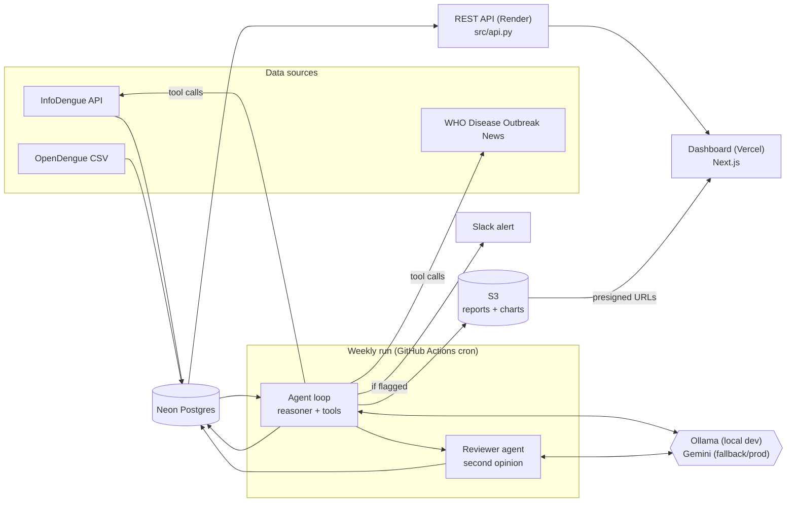

# Contagion Compass
 an autonomous agent that monitors disease surveillance data,
distinguishes meaningful anomalies from normal seasonal noise, investigates
flagged anomalies further, and generates human-readable reports, with a
full log of its own reasoning at every step.

**Live dashboard:** [contagion-compass-dashboard.vercel.app](https://contagion-compass-dashboard.vercel.app)

---

## Architecture



## What it monitors

Weekly dengue fever surveillance for Rio de Janeiro, Brazil, via
[InfoDengue](https://info.dengue.mat.br) (Fiocruz/UFMG's nowcasting API),
compared against a 5-year seasonal baseline built from
[OpenDengue](https://opendengue.org)'s historical dataset. The schema and
agent prompts are disease-agnostic by design — every table and tool call
takes `disease`/`region`/`metric` as parameters, so a second disease is a
data-loading exercise, not a rewrite.

## How it reasons

Rather than a hardcoded "z-score > threshold → alert" rule, an LLM agent
with tool access makes the judgment call and explains it:

1. **Check status** — current reading vs. its historical baseline (mean,
   stddev, z-score).
2. **Investigate, if warranted** — the agent decides whether to pull a
   longer history window, check a trained forecasting model's independent
   expected range, cross-reference climate/Rt data, compare against other
   major cities, or check WHO's official Disease Outbreak News bulletins
   for real-world corroboration, before concluding.
3. **Second opinion** — an independent reviewer agent audits the primary
   verdict against the same data and can agree, disagree, or abstain — a
   built-in check against a single model's blind spots.
4. **Explain and log** — every run writes a full decision-log entry (the
   reading, baseline, tool calls made, reasoning, final verdict) whether
   or not anything was flagged. This is the explainability layer.

Every LLM call uses a **primary + fallback provider** pattern: a local
model (Ollama) is tried first, and any failure — unreachable, out of
memory, rate-limited — falls through to a hosted model (Gemini)
automatically. **Ollama is local-dev-only** — every scheduled/cloud run
(GitHub Actions today, ECS previously) has no path to a local model, so
production always runs on Gemini. No code branches on this; the same
reachability check that picks Ollama locally just fails fast and falls
through when there's nothing to reach.

## Forecasting

Alongside the historical baseline, a [Prophet](https://facebook.github.io/prophet/)
model trained on prior weeks gives the agent a second, independent signal:
a trend/seasonality-based expected range for the current period, evaluated
with an honest train/test split (not just eyeballed).

## Reporting

Every run produces two versions of the same findings from the same
underlying data — no extra model call, just different framing:

- **Policymaker report** — numbers-first: the verdict, baseline
  comparison, z-score, a recommended action, and the agent's full
  reasoning.
- **Plain-language report** — a headline verdict and a narrative
  explanation first, with the technical detail still available underneath,
  not hidden.

## REST API

[`src/api.py`](src/api.py) (FastAPI) exposes the same agent/data layer
over HTTP: trigger a review (`POST /runs`, `POST /runs/sweep`), browse
history (`GET /runs`, paginated and filterable), or hit the underlying
data directly (`GET /status|/history|/forecast/{disease}/{region}/{metric}`,
`GET /regions`). Full interactive docs at `/docs` once running (locally:
[http://localhost:8000/docs](http://localhost:8000/docs)).

## Observability

Optional [Sentry](https://sentry.io) integration
([`src/observability.py`](src/observability.py)) — same blank-env-var-
means-skip pattern as every other optional integration in this project
(S3, Slack): set `SENTRY_DSN` and it activates, leave it blank and nothing
changes. When active: the `llm_provider` in use is tagged on every run, a
breadcrumb is recorded per tool call, and both of the agent's silent
fail-safes (tool-call budget exhausted without a verdict; the reviewer
never returning a structured opinion) are captured as warnings instead of
disappearing quietly. `GET /debug/sentry` triggers a deliberate test error
to verify the pipeline end-to-end (disabled with `ENV=production`).

## Evaluation

[`scripts/evaluate_agent.py`](scripts/evaluate_agent.py) replays historical
weeks through the *real* agent loop (not a reimplementation — it reuses
`reasoner._run_loop` directly, scoped to a point-in-time-correct subset of
data so nothing leaks from the future) and compares the agent's verdict
against the naive `|z| >= 2.5` threshold this project's own backtests
already use. Reports an agreement rate and dumps the agent's reasoning on
every divergence; results persist as JSON to `evaluation/` (gitignored —
regenerate by rerunning) since replaying weeks means real, potentially
rate-limited LLM calls, not something to redo just to re-read a result.

## Deployment

Free-tier stack, no fixed-cost infrastructure:

| Piece | Where | Config |
|---|---|---|
| Database | [Neon](https://neon.tech) (Postgres 16) | pooled connection string in `DATABASE_URL` |
| REST API | [Render](https://render.com) | [`render.yaml`](render.yaml) |
| Weekly agent run | GitHub Actions | [`.github/workflows/weekly-run.yml`](.github/workflows/weekly-run.yml) |
| Dashboard | [Vercel](https://vercel.com) | `dashboard/`, `API_BASE_URL` env var pointing at the Render API |

**Neon:** use the pooled connection string (hostname contains `-pooler`)
from Neon's dashboard — it already appends `?sslmode=require`.
`pool_pre_ping=True` on the shared SQLAlchemy engine
([`src/db/connection.py`](src/db/connection.py)) transparently covers
Neon's free-tier idle-suspend behavior (compute suspends after a few
minutes of inactivity and resumes on the next query, which otherwise
looks identical to a dropped connection).

**Free-tier services sleep when idle:** both Render's free web service
plan and Neon's free compute suspend after a period of inactivity and take
a few seconds to wake back up on the next request — expect a slow first
request after idle time, not a bug.

**S3** still stores generated report/chart files (the dashboard reads
structured run data from the API, but the files themselves stay on S3) —
a deliberate hybrid, not leftover scope: fully removing S3 would mean
either dropping the downloadable reports/chart images from the dashboard
or rebuilding them as on-the-fly rendering, real product work beyond a
deployment migration.

## Tech stack

| Layer | Choice |
|---|---|
| Language | Python (agent + pipeline + API), JavaScript (dashboard) |
| LLM orchestration | Native tool-calling — Ollama (local dev) + Gemini (fallback/production) |
| Forecasting | Prophet |
| Data analysis | pandas, numpy |
| Database | PostgreSQL (Neon, serverless) |
| REST API | FastAPI + Swagger, deployed on Render |
| Scheduling | GitHub Actions (weekly cron) |
| Observability | Sentry (optional) |
| Dashboard | Next.js (App Router), deployed on Vercel |
| Notifications | Slack incoming webhook, deduplicated by severity |

## Project structure

```
src/
  ingest/        # data source pulls (InfoDengue, OpenDengue, WHO DON)
  analysis/      # baselines, z-scores, Prophet forecasting
  agent/         # tool definitions, primary agent loop, reviewer agent,
                 # WHO outbreak-news extraction
  db/            # schema + connection
  api.py         # REST API (FastAPI)
  report.py      # Markdown report rendering (both audiences) + S3 upload
  notify.py      # Slack alerting, with dedup
  observability.py  # optional Sentry init
scripts/         # entry points (run_agent, run_pipeline, refresh_baseline,
                 # evaluate_agent, evaluate_forecast, check_current_week)
tests/           # self-contained checks, no live DB/LLM required
dashboard/       # Next.js app -- /runs API for data, S3 for report/chart files
```

## Running locally

Needs a Postgres 16 server — a native local install, or a free hosted
instance (e.g. [Neon](https://neon.tech)).

```bash
pip install -r requirements.txt
cp .env.example .env                            # fill in DATABASE_URL + GEMINI_API_KEY

python -m scripts.refresh_baseline_infodengue    # one-time: build the Rio de Janeiro baseline
python -m scripts.run_pipeline                   # one-time: OpenDengue Brazil/Mexico backtest data
python -m scripts.run_agent                      # run the agent once

uvicorn src.api:app --reload --port 8000         # REST API + /docs
```

For the dashboard, see [`dashboard/README.md`](dashboard/README.md) —
it needs `API_BASE_URL` pointing at a running API (local or deployed) and
AWS credentials scoped to read the S3 reports prefix.

## Testing

Every module with real logic has a self-contained check (no live DB/LLM
required):

```bash
python -m tests.test_reasoner_loop
python -m tests.test_reviewer_loop
python -m tests.test_report
python -m tests.test_forecast
python -m tests.test_notify
python -m tests.test_infodengue_climate
python -m tests.test_who_don
python -m tests.test_outbreak_news
python -m tests.test_evaluate_agent
python -m tests.test_api
```
